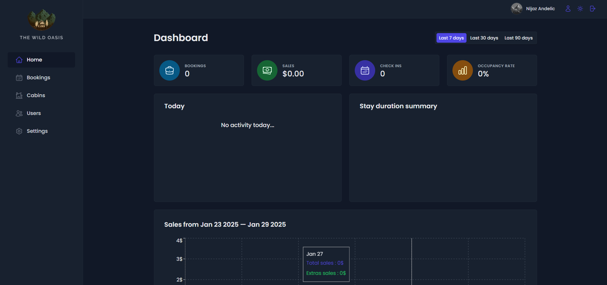

# Wild Oasis: Modern Booking and Management System

You can see the website here:: [Live Demo](https://wildn-oasis.netlify.app/)

## Project Description
Wild Oasis is a feature-rich booking and management application designed for hospitality and resort management. Built with modern web technologies, this project showcases advanced UI/UX patterns, authentication mechanisms, and data visualization techniques. The application follows best practices in professional development, ensuring scalability and maintainability.

---

## Features
- **Authentication System**: Secure user authentication and authorization.
- **React Query for Data Fetching**: Efficient state management and server interactions.
- **Styled Components**: Modular and maintainable CSS-in-JS styling.
- **React Hook Form**: Optimized form handling and validation.
- **Supabase Integration**: Backend services, authentication, and database management.
- **Advanced Compound Component Pattern**: Improved UI component composition and reuse.
- **Charts & Data Visualization**: Interactive charts for business insights.
- **Dark Mode Support**: User-friendly theme switching.

---

## Technologies Used
- **React.js**: Core framework for building the frontend.
- **React Query**: For efficient API handling and caching.
- **Styled Components**: For custom styling and theme management.
- **React Hook Form**: For form validation and handling.
- **Supabase**: For authentication, storage, and database.
- **Chart.js**: For interactive data visualization.
- **React Context API**: For global state management.

---

## Usage
The application is designed for:
- **Resort Owners & Managers**: Managing bookings, guests, and reports.
- **Customers**: IN PROGRESS -- Booking stays and viewing resort details.
- **Developers**: Learning about professional application development patterns.

---

## Screenshots

### Dashboard Overview

### Booking Management

### Cabins Management

> *Screenshots are stored in the `/img` directory.*

---

## Project Status
This project is **actively developed**. Planned enhancements include:
- Adding payment gateway integration.
- Implementing real-time chat support.
- Expanding role-based access control for administrators.

---

## Acknowledgements
This project follows best practices in modern React development, integrating advanced UI/UX and efficient state management. 

---

## License
This project was developed as part of Jonas Schmedtmann’s "The Ultimate React Course."
